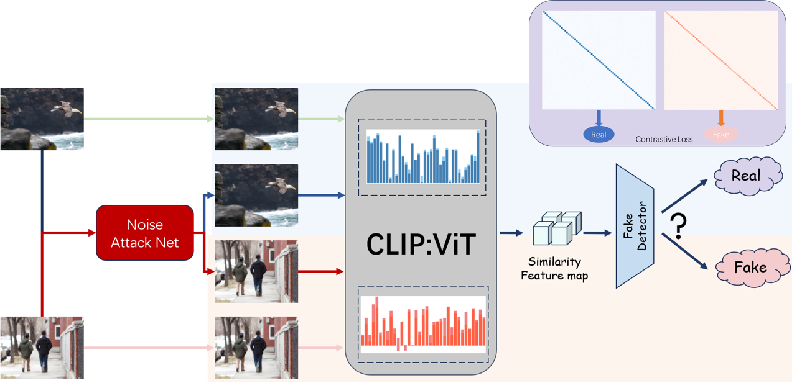

# RFNT: Noise Tolerance Detection between Real and Fake Images

### 🖼️ RFNT

**Black-box Detection: Noise tolerance between real and false images is easier to detect**  
**Author:** Wang Xinchang

<p align="center">
    <a href="https://utkarshojha.github.io/universal-fake-detection/"></a> <br>
    The framework of RFNT(Based on Real and False Images <i>Noise Tolerance</i>  ) 
</p>


---

## 📜 Table of Contents

1. [📦 Setup](https://chatgpt.com/c/6783e678-ce8c-8005-aa6d-050ffab51bab#-setup)
2. [📂 Data](https://chatgpt.com/c/6783e678-ce8c-8005-aa6d-050ffab51bab#-data)
3. [🛠️ Evaluation](https://chatgpt.com/c/6783e678-ce8c-8005-aa6d-050ffab51bab#-evaluation)
4. [📈 Training](https://chatgpt.com/c/6783e678-ce8c-8005-aa6d-050ffab51bab#-training)
5. [🙏 Acknowledgements](https://chatgpt.com/c/6783e678-ce8c-8005-aa6d-050ffab51bab#-acknowledgements)
6. [📌 Citation](https://chatgpt.com/c/6783e678-ce8c-8005-aa6d-050ffab51bab#-citation)

---

## 📦 Setup

1. **Clone this repository:**

   ```bash
   git clone https://github.com/ccandtt/RFNT
   cd RFNT
   ```

2. **Install the necessary libraries:**

   ```bash
   pip install torch torchvision
   ```

---

## 📂 Data

### Download Test Data

- **Sources:**
  - Of the 19 models studied (Tables 1/2 in the main paper), 11 are taken from a [previous work](https://arxiv.org/abs/1912.11035).
  - Test set for these 11 models: [Download here](https://drive.google.com/file/d/1z_fD3UKgWQyOTZIBbYSaQ-hz4AzUrLC1/view) (~19GB).
  - Dataset for diffusion models (e.g., LDM/Glide): [Download here](https://drive.google.com/file/d/1FXlGIRh_Ud3cScMgSVDbEWmPDmjcrm1t/view?usp=drive_link).

### Prepare Data Directory

- Unzip files and structure them as follows:

  ```
  datasets
  └── test
        ├── progan
        │── cyclegan
        │── biggan
        │      .
        │      .
  ```

- For diffusion models:

  - 1k real and 1k fake images per domain (e.g., LDM-200).
  - Place data in `./diffusion_datasets`.

---

## 🛠️ Evaluation

### Evaluate on All Datasets

```bash
python validate.py --arch=CLIP:ViT-L/14 --ckpt=pretrained_weights/fc_weights.pth --result_folder=clip_vitl14
```

### Evaluate on a Specific Dataset

```bash
python validate.py --arch=CLIP:ViT-L/14 --ckpt=pretrained_weights/fc_weights.pth \
                   --result_folder=clip_vitl14 --real_path datasets/test/progan/0_real \
                   --fake_path datasets/test/progan/1_fake
```

- Results will be stored in `results/<folder_name>`:
  - `ap.txt`: Average Precision for each test domain.
  - `acc.txt`: Accuracy (threshold = 0.5).

---

## 📈 Training

1. **Download Training Data:**

   - [Download training dataset](https://drive.google.com/file/d/1iVNBV0glknyTYGA9bCxT_d0CVTOgGcKh/view) (~72GB).

   - Unzip into `datasets/train`:

     ```
     datasets
     └── train
           └── progan
                ├── airplane
                │── bird
                │── boat
                │      .
                │      .
     ```

2. **Train the Model:**

   ```bash
   python train.py --name=clip_vitl14 --wang2020_data_path=datasets/ \
                   --data_mode=wang2020 --arch=CLIP:ViT-L/14 --fix_backbone
   ```

   - **Important:** Use the `--fix_backbone` argument to train only the linear layer.

---

## 🙏 Acknowledgements

We extend our gratitude to the following projects and contributors for their resources and inspiration:

- [Sheng-Yu Wang](https://github.com/PeterWang512) for releasing real/fake images and training pipelines ([CNNDetection](https://github.com/PeterWang512/CNNDetection)).
- [CompVis](https://github.com/CompVis) for pre-trained [LDMs](https://github.com/CompVis/latent-diffusion).
- [LAION](https://laion.ai/) for open-sourcing [LAION-400M dataset](https://laion.ai/blog/laion-400-open-dataset/).
- [AIGCDetectBenchmark](https://github.com/Ekko-zn/AIGCDetectBenchmark) for benchmarking tools and insights.
- [UniversalFakeDetect](https://github.com/Yuheng-Li/UniversalFakeDetect) for their work on fake image detection.

---

## 📌 Citation

If you find our work helpful in your research, please cite it using the following format:

_Citation details will be added here._